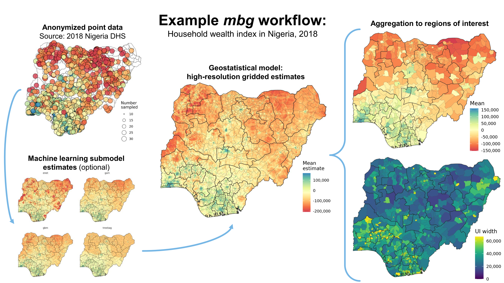

# Model-Based Geostatistics

[](https://cran.r-project.org/package=mbg) [](https://github.com/henryspatialanalysis/mbg/actions/workflows/pkgdown.yaml)


**`mbg` is an R package for model-based geostatistics.**

The `mbg` package provides a simple interface to run spatial machine learning models and geostatistical models that estimate a continuous (raster) surface from point-referenced observations and, optionally, a set of raster covariates. The package also includes functions to summarize raster estimates by (polygon) region while preserving uncertainty.



The `mbg` package combines features from the [`sf`](https://r-spatial.github.io/sf/), [`terra`](https://rspatial.github.io/terra/), and [`data.table`](https://CRAN.R-project.org/package=data.table) packages for spatial data processing; [`caret`](https://topepo.github.io/caret/) for spatial ML models; and [`R-INLA`](https://www.r-inla.org/) for geostatistical models.

---

## Using the package

**You can install the latest stable version of the mbg package from CRAN:**

```install.packages("mbg")```

Some core package functions rely on R-INLA, which is not available on CRAN. If you do not already have the `INLA` package installed, you can download it following [these instructions](https://www.r-inla.org/download-install).

After installing and package and loading it using `library(mbg)`, you can access the package vignette by running `help(mbg)`, or get documentation for a specific function by running e.g. `help(MbgModelRunner)`.

---

## Package workflow

A typical MBG workflow includes the following steps:

1. Load point data on **outcomes**, raster **covariate surfaces**, and a raster **population surface**
2. _(Optional):_ Run **machine learning models** relating the input covariate surfaces to the outcome, producing predictive raster surfaces from a variety of methods
3. **Prepare inputs** for the geostatistical model. This includes the outcomes point data, model specifications, a spatial 2-D mesh, and either the input covariate surfaces or the ML predictive surfaces
4. Run the **geostatistical model**. This model predicts the outcome as a linear combination of the raster surfaces and a SPDE approximation to a Gaussian process over space.
5. Using the model fit, **generate gridded predictions** of the outcome across the entire study area. Uncertainty is captured by generating 250 posterior predictive draws at each pixel location.
6. **Summarize predictive draws** as raster surfaces by taking the mean, median, and 95% uncertainty interval bounds of draws at each pixel location
7. _(Optional):_ **Aggregate** from pixels to administrative boundaries, preserving uncertainty

For more details, see the [introductory vignette](https://henryspatialanalysis.github.io/mbg/articles/mbg.html).
