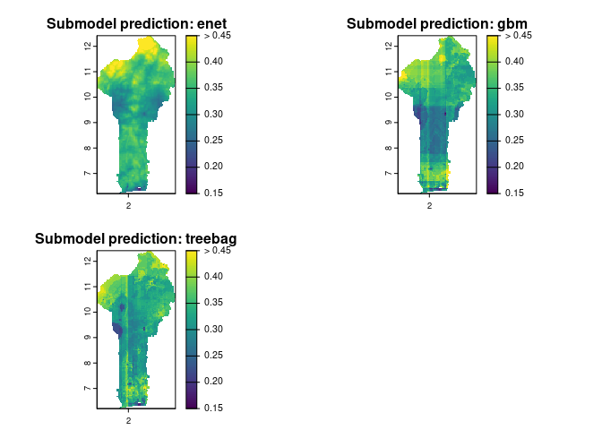
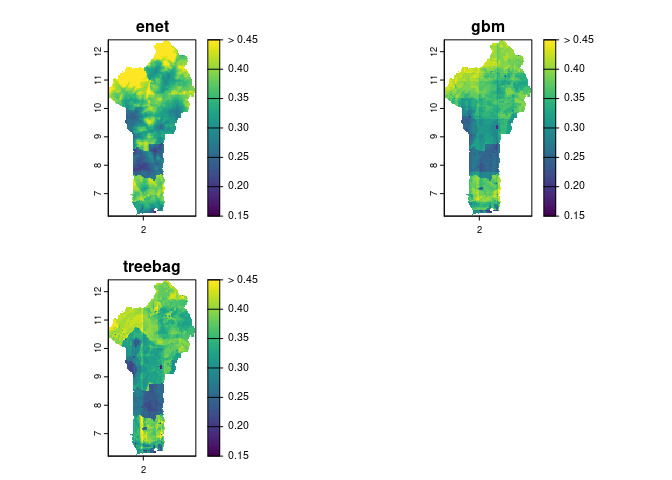
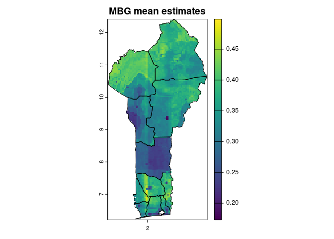

The default MBG setup models a uniform linear relationship between each
covariate and the outcome in modeling space. This assumption may not
always hold: there may be nonlinear relationships, spatially-varying
relationships, and covariate interactions that affect the outcome. If we
want to capture the nuances of these predictor relationships without
over-fitting our model, we can turn to machine learning (ML) algorithms
that are intended to fit over a high-dimensional feature space.

# Setup

In this tutorial, we will run multiple machine learning models using
point-georeferenced outcome data and raster covariate data, then apply
the ML model predictions to generate raster predictions across the
prediction space. To begin, load the `mbg` package and helper packages
for data manipulation, then load the example data. Generate a raster of
the full prediction space using the `build_id_raster()` function.

``` r
## Load packages
library(data.table)
library(sf)
library(terra)
library(mbg)

## Load data
# Outcome: child stunting
outcomes <- data.table::fread(
  system.file('extdata/child_stunting.csv', package = 'mbg')
)
# Spatial covariates, including an intercept
covariates <- list(
  access = terra::rast(system.file('extdata/access.tif', package = 'mbg')),
  evi = terra::rast(system.file('extdata/evi.tif', package = 'mbg')),
  temperature = terra::rast(system.file('extdata/temperature.tif', package = 'mbg'))
)
covariates$intercept <- covariates[[1]] * 0 + 1
# Administrative boundaries
# Departments (first-level administrative divisions)
departments <- sf::st_read(
  system.file('extdata/Benin_departments.gpkg', package = 'mbg'),
  quiet = TRUE
)

# Create ID raster
id_raster <- mbg::build_id_raster(
  polygons = departments,
  template_raster = covariates[[1]]
)
```

# Running ML models with `mbg` and `caret`

The `mbg` package wraps the [`caret`](https://topepo.github.io/caret/)
package to run predictive models over space. The caret (Classification
And REgression Training) package contains 137 different model
specifications for regression: these include linear regression and
generalized linear models, generalized additive models, penalized
regression (LASSO, ridge, elastic net), support vector machines,
regression trees, gradient boosting, neural nets, and more.

You can search the full list of available regression models in the
`caret`
[documentation](https://topepo.github.io/caret/available-models.html).
Note that some models have tuning parameters that can be set beforehand.
We will create a named list of `submodel_settings`, where each name
corresponds to the name of the model we will be using, and each value is
an optional named list containing any tuning parameters we want to pass
to that model.

Each ML model will be tuned using cross-validation. We can control model
tuning by editing `cross_validation_settings`, a named list of arguments
that will be passed to the `caret::trainControl` function.

These models are fit and predictions generated across the study area
using the `run_regression_submodels()` function. This function returns a
named list with two items:

  - `"models"`: The fitted caret models, which can be used to closely
    inspect the model results and generate new predictions
  - `"predictions"`: Rasters containing the predictions of the outcome
    generated from each model.

In the code block below, we run three regression models, using child
stunting in Benin as the outcome and three covariate predictors: elastic
net (a penalized regression method), gradient boosted machines, and
bagged regression trees. We then plot the results across Benin:

``` r
## Run ML models using input covariates
cross_validation_settings <- list(method = 'repeatedcv', number = 5, repeats = 5)
submodel_settings <- list(
  enet = NULL,
  gbm = list(verbose = FALSE),
  treebag = NULL
)
submodels <- mbg::run_regression_submodels(
  input_data = outcomes,
  id_raster = id_raster,
  covariates = covariates,
  cv_settings = cross_validation_settings,
  model_settings = submodel_settings,
  prediction_range = c(0, 1)
)
#> Fitting 3 regression models
#>   Candidate model:  enet
#> Loading required package: ggplot2
#> Loading required package: lattice
#>   Candidate model:  enet: 0.82 sec elapsed
#>   Candidate model:  gbm
#>   Candidate model:  gbm: 1.505 sec elapsed
#>   Candidate model:  treebag
#>   Candidate model:  treebag: 2.395 sec elapsed
#> Fitting 3 regression models: 4.829 sec elapsed
```

``` r
plot(
  terra::rast(submodels$predictions),
  main = paste('Submodel prediction:', names(submodels$predictions)),
  range = c(.15, .45),
  fill_range = TRUE
)
```

<!-- -->

Many machine learning models are robust to handling a large feature
space, meaning that we can add more candidate predictors to the model
without over-fitting. The `run_regression_submodels()` includes the
option to add administrative boundaries to the feature space as one-hot
encoded variables. In the code block below, we use this option to add
department (first-level administrative division) identifiers to the
predictors:

``` r
submodels_with_department_effects <- mbg::run_regression_submodels(
  input_data = outcomes,
  id_raster = id_raster,
  covariates = covariates,
  cv_settings = cross_validation_settings,
  model_settings = submodel_settings,
  use_admin_bounds = TRUE,
  admin_bounds = departments,
  admin_bounds_id = 'department_code',
  prediction_range = c(0, 1)
)
#> Fitting 3 regression models
#>   Candidate model:  enet
#>   Candidate model:  enet: 1.385 sec elapsed
#>   Candidate model:  gbm
#>   Candidate model:  gbm: 2.453 sec elapsed
#>   Candidate model:  treebag
#>   Candidate model:  treebag: 3.346 sec elapsed
#> Fitting 3 regression models: 7.291 sec elapsed
```

``` r
plot(
  terra::rast(submodels_with_department_effects$predictions),
  main = paste('Submodel prediction:', names(submodels_with_department_effects$predictions)),
  range = c(.15, .45),
  fill_range = TRUE
)
```

<!-- -->

# Stacking ML models

The `run_regression_submodels()` function allows users to estimate the
outcome based on many different types of regression models which may not
make similar predictions across the study area. How can we combine
estimates from these models while also incorporating some of the
geostatistical principles used in the baseline `mbg` model? One option
is to use [stacked
generalization](https://pmc.ncbi.nlm.nih.gov/articles/PMC6089257/),
which combines model predictions to create a “super learner” with better
performance than any individual model. [Previous
studies](https://royalsocietypublishing.org/doi/full/10.1098/rsif.2017.0520)
indicate that this “super learner” ensemble can replace the covariate
term in a standard geostatistical model to improve prediction accuracy.

To run a geostatistical model with stacked generalization, create a
`MbgModelRunner` object where `use_stacking = TRUE`. The arguments
`submodel_settings`, `stacking_cv_settings`, and
`stacking_prediction_range` should also be set when running stacked
generalization. In the example below, we also include administrative
effects as one-hot encoded variables in the component submodels.

After enabling stacking, run the `MbgModelRunner$run_mbg_pipeline()`
method to complete the full model workflow. This will now include the
following steps:

  - Run the component regression submodels
  - For each submodel, create estimates of the outcome at each pixel
    across the study area
  - Run the geostatistical model, replacing the standard covariate
    effect with the “super learner” ensemble based on the regression
    submodels
  - Generate final predictions from the geostatistical model

<!-- end list -->

``` r
# Run stacked generalization MBG model
model_runner <- MbgModelRunner$new(
  input_data = outcomes,
  id_raster = id_raster,
  covariate_rasters = covariates,
  use_stacking = TRUE,
  stacking_cv_settings = cross_validation_settings,
  stacking_model_settings = submodel_settings,
  stacking_prediction_range = c(0, 1),
  stacking_use_admin_bounds = TRUE,
  admin_bounds = departments,
  admin_bounds_id = 'department_code'
)
model_runner$run_mbg_pipeline()
#> Fitting 3 regression models
#>   Candidate model:  enet
#>   Candidate model:  enet: 1.017 sec elapsed
#>   Candidate model:  gbm
#>   Candidate model:  gbm: 2.428 sec elapsed
#>   Candidate model:  treebag
#>   Candidate model:  treebag: 3.633 sec elapsed
#> Fitting 3 regression models: 7.231 sec elapsed
#> MBG model fitting
#> MBG model fitting: 10.067 sec elapsed
#> Generating model predictions
#>   Parameter posterior samples
#>   Parameter posterior samples: 5.489 sec elapsed
#>   Cell draws
#>   Cell draws: 2.167 sec elapsed
#>   Summarize draws
#>   Summarize draws: 1.479 sec elapsed
#> Generating model predictions: 9.137 sec elapsed
```

When `use_stacking = TRUE`, the submodel predictions are saved in the
`MbgModelRunner$model_covariates` attribute. These can be pulled and
plotted:

``` r
# Get predictions from each component submodel
mbg_component_models <- model_runner$model_covariates

plot(
  terra::rast(model_runner$model_covariates),
  range = c(.15, .45),
  fill_range = TRUE
)
```

<!-- -->

We can also plot mean estimates from the geostatistical model. Note how
the geostatistical model blends estimates from the component submodels,
while also including other effects including the latent spatial term and
the nugget:

``` r
# Get predictions from the overall model
grid_cell_predictions <- model_runner$grid_cell_predictions
# Plot mean estimates
plot(
  grid_cell_predictions$cell_pred_mean,
  main = 'MBG mean estimates'
)
lines(departments)
```

<!-- -->

As as with the default model, we can plot uncertainty by pixel:

``` r
ui_raster <- grid_cell_predictions$cell_pred_upper - grid_cell_predictions$cell_pred_lower
plot(
  ui_raster,
  col = sf::sf.colors(n = 100),
  main = 'MBG estimates: 95% uncertainty interval width'
)
lines(departments)
```

<!-- -->
